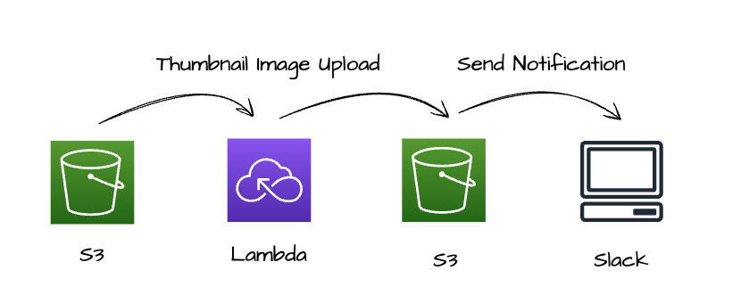

# 쌤(SAM)! 도와주세요!

## 목차

- [들어가며](#들어가며)
    - [발표 이력](#발표-이력)
    - [소개](#소개)
    - [발표 자료](#발표-자료)
- [영상 업로드](#영상-업로드)
- [영상 썸네일 이미지 생성](#영상-썸네일-이미지-생성)
- [메시지 전송](#메시지-전송)

### 들어가며

#### 발표 이력

- 2023년 08월 07일 월요일: AWS 대학생 동아리 AUSG 빅책(BigChat)

#### 소개

본 발표는 쌤(SAM)! 도와주세요! 발표 및 블로그 글에 활용된 레포지토리예요.

#### 발표 자료

발표 자료는 [0417taehyun/Presentation](https://github.com/0417taehyun/Presentation) 레포지토리에서 확인 가능해요.
### 영상 업로드

> 현재 작업 진행 중이에요.

### 영상 썸네일 이미지 생성

#### 소개

영상의 썸네일 이미지를 추출하는 애플리케이션이에요. [thumnail-generator](https://github.com/0417taehyun/help-me-sam/tree/main/thumbnail-generator) 디렉터리에서 프로젝트의 전반 구조와 함께 소스 코드를 살펴볼 수 있어요.

#### 기본 구조

기본 구조는 위 이미지와 같아요. AWS S3에 영상이 업로드 되면 AWS Lambda를 통해 영상의 썸네일 이미지를 추출하고 그 결과를 AWS S3에 업로드해요. 그리고 해당 이미지 파일과 함께 업로드가 완료 되었다는 알림을 특정 Slack 채널에 전송해요.

##### 로컬 환경에서의 구조

이때 로컬 환경에서 AWS Lambda 애플리케이션에 대한 통합 테스트(Integration Test)를 위해 위 이미지와 같이 AWS SAM을 통해 핸들러(Handler)를 호출(Invoke)하고, LocalStack을 활용해 로컬 환경에 AWS의 오브젝트 스토리지 서비즈인 S3를 구축해요.

### 메시지 전송

> 현재 작업 진행 중이에요.
